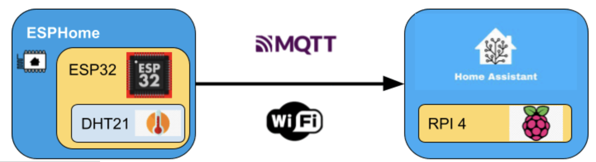
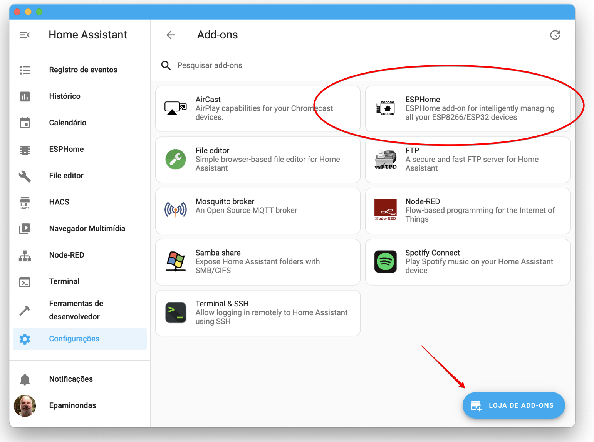
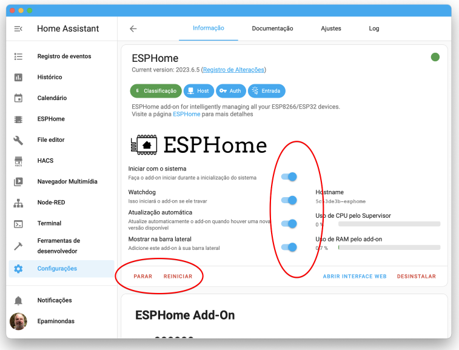

<td style="width: 20%;"></td>

<strong>Home Assistant - ESPHome  </strong>

<strong>Prof Epaminondas Lage</strong>

<a href="http://lattes.cnpq.br/7787341723868111"> Currículo Lattes LAGE, E. S.</a> 

# Índice 
* [Sites relacionados ao ESPHome](#Sites-relacionados-ao-ESPHome)
* [ESPHome](#ESPHome) 
* [Protocolo de comunicação do ESPHome](#Protocolo-de-comunicação-do-ESPHome) 
* [Comparação entre ESP32 e ESP8266](#Comparação-entre-ESP32-e-ESP8266) 
* [ESP32](#ESP32) 
* [ESP8266](#ESP8266) 

# Sites relacionados ao ESPHome
* Site do ESPHome https://esphome.io/
* Configuração da Biblioteca de Placas (Colar o link no preferences da IDE Arduino):  
   https://arduino.esp8266.com/stable/package_esp8266com_index.json
* ch340-drivers. NodeMCU V3
    https://learn.sparkfun.com/tutorials/how-to-install-ch340-drivers/all *
* CP210x USB to UART Bridge  NodeMCU V3
https://www.silabs.com/developers/usb-to-uart-bridge-vcp-drivers

# ESPHome  

ESPHome é uma estrutura de firmware de código aberto para microcontroladores como ESP8266 e ESP32. Ele permite a configuração e integração de dispositivos IoT personalizados por meio de uma linguagem de configuração baseada em YAML. A plataforma ESPHome suporta uma variedade de componentes, como sensores, atuadores e interfaces de comunicação, incluindo MQTT e API REST. Ela oferece recursos avançados, como atualização OTA (Over-The-Air) para facilitar a atualização remota do firmware dos dispositivos.

O ESPHome é especialmente popular entre os desenvolvedores e entusiastas de IoT, pois permite o desenvolvimento de dispositivos personalizados e a integração com outros sistemas de automação residencial, como o Home Assistant. Com o ESPHome, é possível criar sensores, interruptores e outros dispositivos inteligentes controlados por Wi-Fi.

Graças à sua flexibilidade e extensibilidade, o ESPHome torna o processo de desenvolvimento de dispositivos IoT mais acessível a uma ampla gama de usuários. Ele fornece controle total sobre o firmware, permitindo personalizar os dispositivos conforme necessário. O ESPHome simplifica o desenvolvimento de soluções de IoT, proporcionando uma base sólida para a criação de dispositivos conectados e sistemas de automação residencial.

# Protocolo de comunicação do ESPHome

O ESPHome pode usar o protocolo MQTT para comunicação entre os dispositivos ESP8266/ESP32 e o Home Assistant, mas não é exclusivamente limitado a esse protocolo. O ESPHome suporta várias opções de comunicação, e MQTT é apenas uma delas.

Figura x: Comunicação ESPHome - Home Assistant

Quando se trata de comunicação com o Home Assistant, o ESPHome possui duas opções principais:

<ol>
<li>API Nativa: A API nativa é o método de comunicação padrão usado pelo ESPHome para integrar-se com o Home Assistant. Essa opção permite que o dispositivo ESPHome se comunique diretamente com o Home Assistant, tornando a integração mais direta e menos dependente de outras ferramentas.</li>

<li>MQTT: O MQTT é um protocolo de mensagens leve e amplamente utilizado em sistemas de automação residencial e da Internet das Coisas (IoT). O ESPHome também suporta a comunicação via MQTT, o que significa que você pode configurar seus dispositivos ESPHome para se comunicarem com o Home Assistant usando o protocolo MQTT.</li>
</ol>

Ao utilizar o MQTT, o ESPHome publica e/ou subscreve tópicos MQTT para enviar e receber dados do Home Assistant. Os dados enviados podem incluir leituras de sensores, estado de atuadores, informações de dispositivos e outras informações relevantes.

# Comparação entre ESP32 e ESP8266

O ESP32 e o ESP8266 são dois microcontroladores populares desenvolvidos pela empresa Espressif Systems. Embora ambos os dispositivos sejam amplamente utilizados em projetos de IoT e compartilhem algumas características semelhantes, eles também possuem diferenças significativas em termos de desempenho, recursos e capacidades de conectividade. Segue uma comparação entre o ESP32 e o ESP8266:
<ol>
<li>Processador: O ESP32 possui um processador de 32 bits mais poderoso e rápido em comparação com o ESP8266. Enquanto o ESP8266 normalmente opera a uma velocidade de 80 MHz, o ESP32 pode operar em frequências de até 240 MHz.</li>
<li>Núcleos de CPU: O ESP32 é equipado com dois núcleos de CPU, permitindo a execução de múltiplas tarefas simultaneamente. Já o ESP8266 possui apenas um núcleo de CPU.</li>
<li>Conectividade Wi-Fi: Ambos os microcontroladores suportam conectividade Wi-Fi, mas o ESP32 oferece suporte a padrões mais avançados, como 802.11 b/g/n e 802.11ac. Isso significa que o ESP32 é capaz de alcançar velocidades de conexão Wi-Fi mais altas do que o ESP8266.</li>
<li>Bluetooth: Uma das principais diferenças entre os dois microcontroladores é que o ESP32 possui suporte embutido para Bluetooth, incluindo Bluetooth clássico e Bluetooth de baixa energia (BLE). O ESP8266 não possui suporte nativo para Bluetooth.</li>
<li>Memória: O ESP32 geralmente possui mais memória disponível em comparação com o ESP8266. Isso inclui tanto a memória flash para armazenamento de código e dados quanto a memória RAM para execução de programas. O ESP32 pode variar de 4 MB a 16 MB de memória flash, enquanto o ESP8266 geralmente possui opções de 512 KB a 16 MB de memória flash.</li>
<li>GPIOs: O número de pinos GPIO disponíveis no ESP32 é geralmente maior do que no ESP8266, o que oferece mais flexibilidade para conectar periféricos e sensores externos.</li>
<li>Periféricos adicionais: O ESP32 oferece suporte a uma variedade de periféricos adicionais em comparação com o ESP8266. Isso inclui suporte para Ethernet, interfaces de câmera, interfaces de toque capacitivo, entre outros.</li>
<li>Consumo de energia: Embora ambos os microcontroladores sejam projetados para baixo consumo de energia, o ESP32 pode ser mais eficiente em termos de consumo energético em certos cenários devido ao suporte a recursos de economia de energia mais avançados.</li>
</ol>
No geral, o ESP32 é uma opção mais avançada e poderosa em comparação com o ESP8266. Ele oferece maior velocidade de processamento, mais memória, suporte a Bluetooth e uma variedade de periféricos adicionais. No entanto, o ESP8266 ainda é uma escolha viável para projetos mais simples e com requisitos mais básicos de conectividade Wi-Fi. A escolha entre os dois microcontroladores depende das necessidades específicas do projeto e das funcionalidades desejadas.

# ESP32

O ESP32 é um microcontrolador de baixo custo e baixo consumo de energia desenvolvido pela Espressif Systems. Ele é baseado na arquitetura Xtensa LX6 e é amplamente utilizado em projetos de IoT e dispositivos inteligentes. Ele possui um processador dual-core de 32 bits com clock de até 240 MHz, o que permite uma maior capacidade de processamento em comparação com outros microcontroladores. Ele também possui uma ampla variedade de periféricos, incluindo GPIOs, UART, SPI, I2C, PWM e ADC, que permitem a interação com diferentes dispositivos e sensores.

Uma das principais vantagens do ESP32 é a presença de conectividade Wi-Fi e Bluetooth integrada. Isso permite que os dispositivos baseados em ESP32 se conectem a redes sem fio, interajam com outros dispositivos e se integrem a serviços em nuvem. Além disso, o ESP32 possui uma ampla gama de recursos adicionais, como suporte para criptografia e segurança, suporte para atualizações de firmware OTA (Over-The-Air) e suporte para armazenamento externo de dados, como cartões SD.

Existem vários modelos de microcontroladores ESP32 disponíveis no mercado, cada um com suas próprias características. Aqui estão alguns dos modelos mais comuns:
<ol>
<li>ESP32-WROOM-32: Este é o módulo mais básico e amplamente utilizado do ESP32. Ele possui um processador dual-core Xtensa LX6 de 32 bits, Wi-Fi integrado (802.11b/g/n), Bluetooth 4.2 e uma ampla variedade de periféricos GPIO, UART, SPI, I2C, PWM e ADC. Também possui suporte para criptografia e segurança.</li>
<li>ESP32-WROOM-32D: É uma versão aprimorada do ESP32-WROOM-32, com uma antena embutida para melhorar o desempenho do Wi-Fi e do Bluetooth.</li>
<li>ESP32-WROVER: Este modelo possui todas as características do ESP32-WROOM-32, mas também inclui 4 MB de memória flash externa PSRAM, que pode ser usada para armazenamento adicional de dados ou para executar aplicativos mais complexos.</li>
<li>ESP32-WROVER-B: É uma versão atualizada do ESP32-WROVER, com 8 MB de memória flash externa PSRAM para maior capacidade de armazenamento.</li>
<li>ESP32-PICO-D4: É um módulo compacto do ESP32 que inclui o processador, memória flash, cristal oscilador e componentes relacionados em um único pacote. Ele é amplamente utilizado em aplicações onde o espaço é limitado.</li>
</ol>
   
Além desses modelos, existem variações e versões personalizadas do ESP32 disponíveis de diferentes fabricantes e fornecedores.

As características gerais do ESP32 incluem:
<ul>
<li>Processador dual-core Xtensa LX6 de 32 bits.</li>
<li>Clock de até 240 MHz.</li>
<li>Wi-Fi integrado (802.11b/g/n).</li>
<li>Bluetooth integrado (até a versão 5.0).</li>
<li>Diversos periféricos, como GPIOs, UART, SPI, I2C, PWM e ADC.</li>
<li>Suporte para criptografia e segurança.</li>
<li>Capacidade de memória flash interna, geralmente variando de 4 MB a 16 MB.</li>
<li>Possibilidade de expansão de memória externa usando PSRAM.</li>
<li>Suporte para atualizações de firmware OTA (Over-The-Air).</li>
<li>Opções de baixo consumo de energia.</li>
</ul>

Integração com vários frameworks e plataformas de desenvolvimento, como o ESP-IDF (Espressif IoT Development Framework) e o Arduino. 

# ESP8266

O ESP8266 é um microcontrolador de baixo custo e baixo consumo de energia desenvolvido pela empresa chinesa Espressif Systems. Ele é amplamente utilizado em projetos de Internet das Coisas (IoT) devido às suas capacidades de conectividade Wi-Fi integrada e suporte a uma variedade de protocolos de comunicação.

Principais características do ESP8266:
<ol>
<li>Processador: O ESP8266 possui um processador de 32 bits com arquitetura RISC, geralmente operando a uma velocidade de 80 MHz.</li>
<li>Conectividade Wi-Fi: É uma das principais vantagens do ESP8266. Ele suporta o padrão 802.11 b/g/n, permitindo a comunicação sem fio com outros dispositivos ou redes. </li>
<li>Memória: O ESP8266 geralmente possui uma memória flash embutida para armazenamento de código e dados. As capacidades de memória variam entre os modelos, mas geralmente estão disponíveis em tamanhos de 512 KB a 16 MB.</li>
<li>Periféricos: O microcontrolador possui uma variedade de periféricos integrados, incluindo GPIOs (General-Purpose Input/Output), UART (Universal Asynchronous Receiver/Transmitter), SPI (Serial Peripheral Interface) e I2C (Inter-Integrated Circuit). Esses periféricos permitem a comunicação e a interação com outros dispositivos externos.</li>
<li>Baixo consumo de energia: O ESP8266 é projetado para ser eficiente em termos de consumo de energia, tornando-o adequado para dispositivos alimentados por bateria ou energia limitada.</li>
<li>Suporte a protocolos de comunicação: Além do Wi-Fi, o ESP8266 suporta outros protocolos de comunicação, como TCP/IP, UDP, MQTT e HTTP. Isso permite a integração com plataformas de nuvem, serviços da web e aplicativos móveis.</li>
<li>Frameworks de desenvolvimento: O ESP8266 é compatível com vários frameworks de desenvolvimento, incluindo o Arduino IDE, o MicroPython e o Espressif IoT Development Framework (ESP-IDF). Isso facilita a programação e o desenvolvimento de aplicativos para o microcontrolador.</li>
<li>Tamanho compacto: O ESP8266 é disponibilizado em diferentes formatos, como módulos ou chips, com dimensões reduzidas. Isso permite sua fácil integração em projetos com espaço limitado.</li>
   
</ol>
O ESP8266 é uma opção popular para projetos de IoT devido à sua conectividade Wi-Fi embutida, baixo custo, facilidade de uso e ampla comunidade de desenvolvedores. Ele pode ser utilizado em uma variedade de aplicações, como automação residencial, monitoramento remoto, controle de dispositivos e muitos outros.

# Instalando o ESPHome no Home Assistant

1- Instale o complemento ESPHome Dashboard no Home Assistant

* Acesse o Home Assistant em seu navegador web.
* No painel esquerdo, clique em "Supervisor" e selecione "Add-on Store".
* Na loja de Addons, procure por "ESPHome Dashboard".
* Clique no complemento e, em seguida, clique no botão "Instalar".

Figura x: Instalação do ESPHme no Home Assistant

2- Configurar o complemento ESPHome Dashboard

* Depois de instalar o complemento, clique em "Configuração".
* Aqui você pode ajustar as configurações do complemento, como a porta que ele usará.

Figura x: Configuração do ESPHme no Home Assistant

